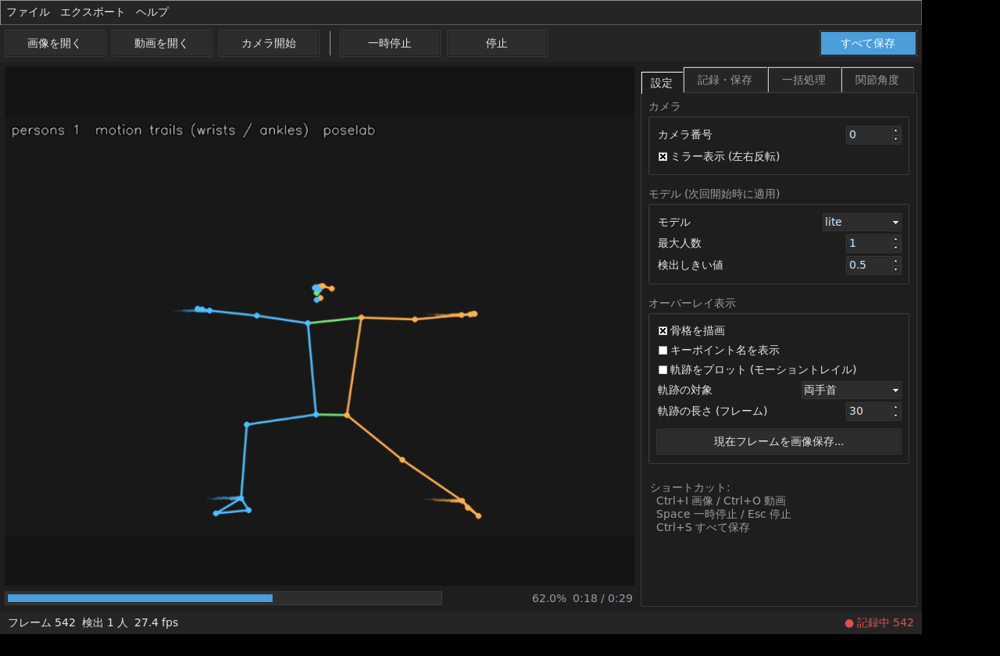
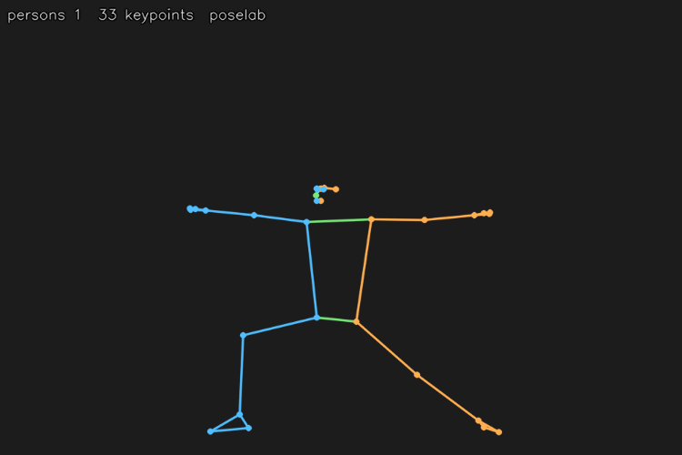

# poselab — 研究用ヒト骨格推定ツールキット

画像・動画・カメラ入力からヒトの骨格 (33 キーポイント) を推定し、
座標データを CSV / JSON / NumPy 形式でエクスポートできるツールです。
GUI と CLI の両方から使用できます。



*GUI (ダークテーマ): 骨格プレビューとモーショントレイル、再生位置 (%)、
記録インジケータ、タブ構成の設定パネル
(画面は推定結果の骨格・軌跡のみを描画した例)*

- 推定エンジン: [MediaPipe Pose Landmarker](https://ai.google.dev/edge/mediapipe/solutions/vision/pose_landmarker) (Apache-2.0) を依存ライブラリとして利用
- 本リポジトリのコードはすべて独自実装 (MIT ライセンス)
- 2D ピクセル座標・正規化座標・3D ワールド座標 (メートル単位) ・信頼度を出力
- 複数人検出に対応 (`--num-poses`)

## インストール

Python 3.9 以上が必要です。

```bash
git clone <this-repo>
cd 3d
pip install -e .
```

(PyPI 公開後は `pip install poselab-toolkit` でもインストールできる予定です。
配布名は poselab-toolkit ですが、import 名・コマンド名は `poselab` です)

GUI を使う場合は tkinter も必要です (多くの環境では同梱。Ubuntu では
`sudo apt install python3-tk`)。

初回実行時に推定モデル (約 5–30 MB、Apache-2.0) が
`~/.cache/poselab/` に自動ダウンロードされます。
保存先は環境変数 `POSELAB_CACHE_DIR` で変更できます。

### カメラが開けないとき

`カメラ 0 を開けませんでした` と表示される場合:

1. `poselab --list-cameras` (または GUI の「使えるカメラを検索」) で
   利用可能なカメラ番号を確認する
2. 他のアプリ (Zoom / Teams / ブラウザ等) がカメラを使用中なら終了する
3. Windows: 設定 → プライバシーとセキュリティ → カメラ →
   「デスクトップアプリにカメラへのアクセスを許可」を ON にする
4. ノート PC 内蔵カメラ + USB カメラ構成では番号が 1 や 2 のことがあります

Windows では標準バックエンド (MSMF) で開けない場合、自動的に
DirectShow で再試行します。

### Windows での利用

Windows (64bit Python 3.9–3.12) でも動作します。

- 画像の読み書きは日本語パスに対応しています (内部で
  `imdecode` / `imencode` を使用)
- **動画ファイル**のパスは OpenCV のバックエンド依存のため、
  日本語を含むパスで開けない場合は英数字のみのパスをお試しください
- Anaconda 環境で GUI が起動しない場合は `conda install tk`

## CLI の使い方

```bash
# 動画を処理して座標 CSV と骨格描画済み動画を出力
poselab --input walk.mp4 --csv walk.csv --save-video walk_annotated.mp4

# 静止画 (複数指定可)
poselab --input a.jpg b.jpg --json poses.json

# 1 枚の画像に骨格を描画して保存
poselab --input photo.jpg --save-image annotated.jpg --csv photo.csv

# カメラ 0 番をライブプレビューしながら座標を記録 (q キーで終了)
poselab --input camera:0 --show --csv live.csv

# 複数人検出 (3 人まで)。ID トラッキング + P0/P1... バッジ描画は自動で有効
poselab --input dance.mp4 --model heavy --num-poses 3 --npz dance.npz \
        --csv dance.csv --save-video dance_tracked.mp4

# 関節角度 (肘・肩・股・膝・足首) の時系列 CSV + 5 フレーム移動平均で平滑化
poselab --input squat.mp4 --angles-csv angles.csv --csv coords.csv --smooth 5

# キーポイント速度 (px/s, m/s) と処理サマリ (検出率等) も出力
poselab --input run.mp4 --velocity-csv vel.csv --summary-json summary.json

# 手首・足首の軌跡 (直近 30 フレーム) を動画上にプロットして書き出し
poselab --input swing.mp4 --save-video swing_trail.mp4 \
        --trail 30 --trail-keypoints left_wrist,right_wrist,left_ankle,right_ankle

# キーポイント名一覧 / 環境診断
poselab --list-keypoints
poselab --info
```

処理中はプログレスバー (%, fps, 残り時間) が表示されます:

```
[##############----------]  60.0%  18/30  15.9 fps  残り 0:01
```

主なオプション:

| オプション | 説明 |
| --- | --- |
| `--input` | 画像/動画パス、または `camera:0` 形式のカメラ指定 |
| `--model {lite,full,heavy}` | モデルサイズ (lite=高速 / heavy=高精度) |
| `--num-poses N` | 最大検出人数 (2 以上で ID トラッキングが自動有効) |
| `--no-track` | 人物 ID トラッキングを無効化 |
| `--csv` / `--json` / `--npz` | 座標データの出力先 |
| `--angles-csv` | 関節角度 (10 関節) の時系列 CSV |
| `--velocity-csv` | キーポイント速度 (px/s と m/s) の時系列 CSV |
| `--summary-json` | 処理サマリ (検出率・平均人数等) の JSON |
| `--smooth N` | N フレーム移動平均による座標の平滑化 |
| `--info` | 環境診断 (バージョン・モデルキャッシュ状況) |
| `--save-video` / `--save-image` | 骨格描画済みメディアの出力先 |
| `--show` | プレビューウィンドウ表示 |
| `--draw-labels` | キーポイント名も描画 |
| `--trail N` | キーポイント軌跡を直近 N フレーム分プロット |
| `--trail-keypoints` | 軌跡対象 (カンマ区切り、`all` で全 33 点) |
| `--camera-mirror` | カメラ映像を左右反転 (鏡像) で処理 |
| `--max-frames N` | 処理フレーム数の上限 |

## GUI の使い方

```bash
poselab-gui
```

- **ダークテーマ UI**: ツールバー + タブ構成 (設定 / 記録・保存 / 一括処理 /
  関節角度) で整理されたパネル、記録中インジケータ付きステータスバー
- **入力**: 画像・動画ファイルを開く、またはカメラ番号を指定して開始
  (ミラー表示の切り替え可)。ショートカット: Ctrl+I (画像) / Ctrl+O (動画)
- **ライブプレビュー**: 骨格オーバーレイ・FPS・再生位置 (% と時刻、
  カメラは LIVE 経過時間) を表示。Space で一時停止 / 再開、Esc で停止、
  表示中フレームの画像保存も可能
- **軌跡のプロット**: 手首・足首などの移動軌跡 (モーショントレイル) を
  実際の映像の上に重ねて表示。対象と長さは選択可能で、一括処理の
  出力動画にも反映されます
- **関節角度のライブ表示**: 10 関節の角度をリアルタイムでパネル表示
  (信頼度の低い値には ? マーク)
- **記録**: 「座標を記録する」を有効にすると推定結果が蓄積され、
  CSV / JSON / NPZ / 関節角度 / 速度にエクスポートできます。
  Ctrl+S で全 5 形式を一括保存。エクスポート時の移動平均平滑化にも対応
- **一括処理**: 動画ファイルを選ぶと、座標 (CSV + JSON) ・関節角度 CSV ・
  骨格描画済み動画 (MP4) を進捗 % と残り時間の表示付きで一括生成します
- **状況表示**: 処理終了時に検出率 (%) のサマリを表示
- **設定の保存**: モデル・しきい値などの設定は終了時に自動保存され、
  次回起動時に復元されます

## 出力フォーマット



*推定された 33 キーポイント (左半身=オレンジ、右半身=水色、体幹=緑)*

### CSV (ロング形式、1 行 = 1 キーポイント)

| 列 | 意味 |
| --- | --- |
| `frame`, `timestamp_ms` | フレーム番号、タイムスタンプ |
| `person` | 人物インデックス (複数人検出時) |
| `keypoint_id`, `keypoint_name` | キーポイント番号・名前 |
| `x_px`, `y_px` | ピクセル座標 |
| `x_norm`, `y_norm` | 画像サイズで正規化した座標 (0–1) |
| `z` | 腰中心を原点とする相対深度 (近いほど負) |
| `visibility`, `presence` | 可視性・存在の推定確率 (0–1) |
| `world_x`, `world_y`, `world_z` | 3D ワールド座標 (メートル、腰中心が原点) |

pandas でそのまま解析できます:

```python
import pandas as pd
df = pd.read_csv("walk.csv")
wrist = df[df.keypoint_name == "right_wrist"]
```

### 関節角度 CSV (`--angles-csv`)

肘・肩・股関節・膝・足首 (左右計 10 関節) について、3 点のなす角を
度単位で出力します。ワールド座標 (3D) がある場合はそれを優先し
(`coordinates=world`)、なければピクセル座標 (2D) で計算します。
列: `frame, timestamp_ms, person, angle_name, angle_deg, min_visibility, coordinates`

### 速度 CSV (`--velocity-csv`)

前フレームとの差分から各キーポイントの速度を計算します。
ピクセル座標系の `vx_px_per_s` / `vy_px_per_s` / `speed_px_per_s` と、
ワールド座標系の `speed_m_per_s` (m/s) を出力します。
検出が途切れた直後のフレームは行を生成しません。

### サマリ JSON (`--summary-json`)

`total_frames` / `detected_frames` / `detection_rate` / `max_persons` /
`mean_persons` / `mean_visibility` / `duration_s` などの品質指標です。

### JSON

`metadata` (ツール情報・キーポイント名一覧) と `frames` (フレームごとの
全人物・全キーポイント) を持つ構造化データです。

### NPZ (NumPy)

- `keypoints`: `(フレーム数, 人数, 33, 5)` — `[x_px, y_px, z, visibility, presence]`
- `world`: `(フレーム数, 人数, 33, 4)` — `[x, y, z, visibility]`
- `timestamps_ms`, `frame_indices`, `keypoint_names`
- 未検出は NaN

```python
import numpy as np
data = np.load("dance.npz")
right_wrist_xy = data["keypoints"][:, 0, 16, :2]  # 16 = right_wrist
```

## Python API

```python
from poselab.backends import create_backend
from poselab.pipeline import run_pipeline
from poselab.sources import open_source

source = open_source("walk.mp4")
backend = create_backend("mediapipe", model="full", num_poses=2)
results = run_pipeline(source, backend)
for frame in results:
    for person in frame.persons:
        nose = person.keypoints[0]
        print(frame.frame_index, nose.x_px, nose.y_px, nose.visibility)
backend.close()
```

バックエンドは `poselab.backends.base.PoseBackend` を継承することで
他の推定エンジンにも差し替えられる設計です。

## テスト

```bash
pip install pytest
pytest tests/
```

## ライセンスについて

- 本リポジトリのコード: **MIT License** (LICENSE 参照)
- 依存ライブラリ: MediaPipe (Apache-2.0)、OpenCV (Apache-2.0)、
  NumPy (BSD)、Pillow (MIT-CMU) — いずれも公開 API 経由で利用しており、
  コードのコピーは含みません
- 自動ダウンロードされる Pose Landmarker モデル: Apache-2.0 (Google 提供)
- 研究利用・改変・再配布は各ライセンスの条件の範囲で自由に行えます

## 研究利用上の注意

- `z` (画像座標系の深度) は相対値であり、ワールド座標 (`world_*`) と
  スケールが異なります。3D 解析にはワールド座標の使用を推奨します
- 推定値にはノイズが含まれるため、解析前に `visibility` でのフィルタや
  平滑化を検討してください (`--smooth N` で NaN 対応の移動平均を適用
  できます。より高度な平滑化が必要なら Savitzky–Golay フィルタ等を)
- 複数人検出時 (`--num-poses` 2 以上) は人物 ID トラッキングが自動で
  有効になり、CSV / JSON / NPZ の `person` 列はフレーム間で安定した
  ID になります (映像上にも P0 / P1... のバッジを描画)。マッチングは
  等速モデルによる位置予測と胴体の色ヒストグラム (服装) を併用して
  おり、交差・すれ違いにも頑健です (`--no-track` で無効化可能)
- それでも ID が入れ替わるリスクは残るため、**人物同士が接近・交差した
  区間と、長いオクルージョン後に再出現した事象は自動検出され、処理後に
  警告として表示されます** (CLI はターミナル、GUI はダイアログ、
  `--summary-json` には `id_warnings` として記録)。該当区間の前後では
  ID の連続性を確認してください
- カメラのミラー表示 (`--camera-mirror`) 使用時は、キーポイントの
  left/right が被写体の実際の左右と逆になります
